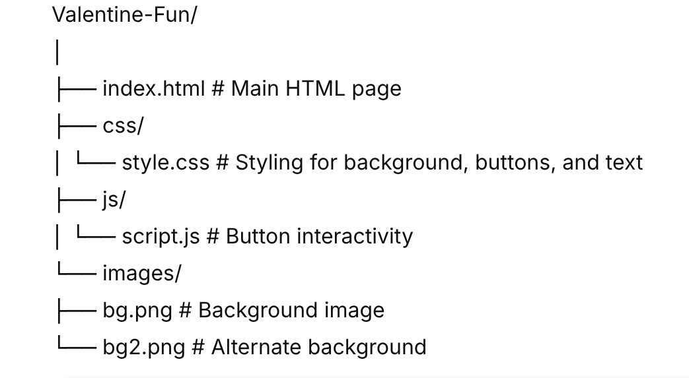

# Valentine Fun 💖

A playful Valentine-themed web page that asks **“Will you be my valentine?”** with interactive buttons:  

- **YES** button shows a romantic message.  
- **NO** button playfully runs away from the mouse.  

Perfect for surprising someone in a fun and cute way! 🌹

---

## 🖥️ Demo

Open the `index.html` file in your browser to try it out.

---

## 📂 Project Structure



---

## 🎨 Features

- Full-screen Valentine background  
- YES button grows on hover  
- NO button escapes when hovered  
- Responsive design for mobile and desktop  
- Shows **“I love you 💖”** message on clicking YES  

---

## ⚡ How to Run

1. Clone the repository:

```bash
git clone https://github.com/dikeshsapkota/Valentine-Fun.git
